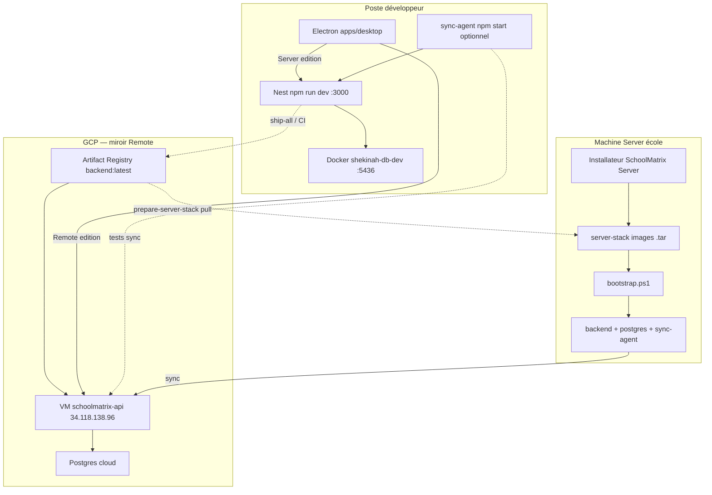

# Environnements SchoolMatrix — logique d’exploitation

Ce document est la **source de vérité** pour séparer développement et production.

## Schéma



## 1. DEV — poste développeur

| Composant | Où | Comment |
|-----------|-----|---------|
| Code source | ce dépôt | Git |
| API | process Node local | `cd shekinah-schoolmatrix-backend && npm run dev` |
| UI | Electron + Vite | `cd apps/desktop && npm run dev` |
| Postgres | conteneur **`shekinah-db-dev`** | port hôte **5436** — voir `dev/docker-compose.postgres.yml` |
| Sync-agent | process Node local (optionnel) | **lab** `npm run dev:sync-lab` (miroir `:3001`) — pas la VM GCP |

**Règles :**

- En DEV, le backend Nest tourne **hors Docker**.
- Docker utile au quotidien = **Postgres DEV** (`shekinah-db-dev`). Pour tester la sync : second Postgres `shekinah-db-cloud-dev` (lab, pas GCP).
- Ne pas traiter les conteneurs `schoolmatrix_*_server` sur ce PC comme « l’école ».

### Piège fréquent sur le PC de dev

Si tu as déjà lancé l’installateur Server (ou `prepare-server-stack` + bootstrap), Docker Desktop peut contenir :

- `shekinah_api_server` → **occupe le port 3000**
- `shekinah_postgres_server`
- `shekinah_sync_agent`

Alors Nest local ne peut plus binder `:3000`, et tu mélanges stack « prod école » et DEV.

**Libérer le port pour coder :**

```powershell
npm run dev:free-port
```

Cela arrête uniquement le projet Docker `schoolmatrix-server` sur **cette machine**. Ça ne touche ni GCP ni une vraie école.

## 2. CLOUD GCP — API Remote

| Élément | Valeur |
|---------|--------|
| Projet | `shekinah-schoolmatrix` |
| VM | `schoolmatrix-api` / `34.118.138.96` |
| Compose | `infra/docker/docker-compose.gcp.yml` |
| Conteneurs typiques | `shekinah_api_cloud`, `shekinah_postgres_cloud` |
| Sync-agent | **non** (le cloud est miroir ; l’agent vit côté école / tests locaux) |
| Mise à jour | CI `Backend - build and push to GCP` ou `ship-all` |

Les apps **Remote**, futures apps natives et sites web parlent à **cette** API.

## 3. SERVER école — vérité locale

| Élément | Valeur |
|---------|--------|
| Livrable | exe **SchoolMatrix Server** |
| Bundle | `apps/desktop/server-stack/` (`images/*.tar`, `bootstrap.ps1`, `defaults.env`) |
| Sur site | `C:\ProgramData\Shekinah SchoolMatrix\server-stack` |
| Conteneurs | `shekinah_api_server`, `shekinah_postgres_server`, `shekinah_sync_agent` |
| Mise à jour | feed GCS → MAJ auto → `bootstrap.ps1` → `docker load` |

**Seul** ce chemin met à jour une école. Modifier `infra/docker/docker-compose.gcp.yml` ou le Docker du laptop **ne change rien** sur site.

## Matrice « qu’est-ce que je touche ? »

| Intention | Action |
|-----------|--------|
| Coder une feature UI/API | Nest + `apps/desktop` + Postgres DEV |
| Tester sync | `dev:backend` + `dev:backend:cloud` + `dev:sync-lab` (miroir local `:3001`) — **pas** la VM GCP |
| Publier API pour Remote | CI / `ship-all` → Artifact Registry → VM |
| Publier pour les écoles | `ship-all` avec build Server (attend AR puis `prepare-server-stack`) |
| Publier Remote desktop | feed GCS `installers/remote/` |
| Expérimenter l’ancien AWS/ECR/Next | `_archive/` seulement — **interdit** pour le produit actuel |

## Fichiers à ne pas confondre

| Fichier | Cible |
|---------|--------|
| `dev/docker-compose.postgres.yml` | Postgres **DEV** (`:5436`) |
| `dev/docker-compose.sync-cloud.yml` | Postgres **miroir lab** (`:5437`) — pas GCP |
| `apps/desktop/server-stack/docker-compose.yml` | Stack **embarquée** installateur école |
| `infra/docker/docker-compose.server.yml` | Référence ops (pull AR) — **pas** l’école |
| `infra/docker/docker-compose.gcp.yml` | **Cloud uniquement** |
| `_archive/**/docker-compose*.yml` | Legacy mort |

Voir aussi [DEV.md](DEV.md), [DESKTOP.md](DESKTOP.md), [RELEASE.md](RELEASE.md).
